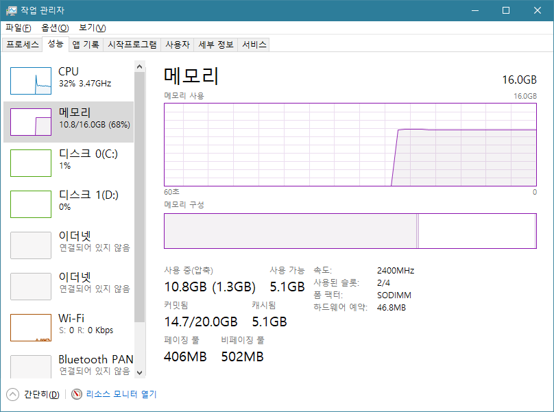
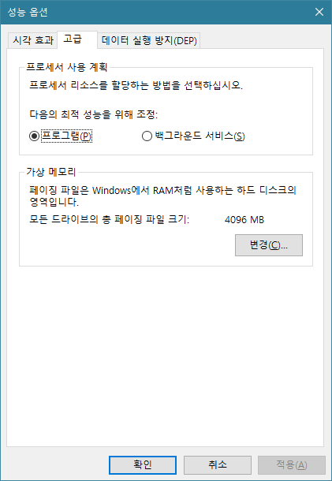
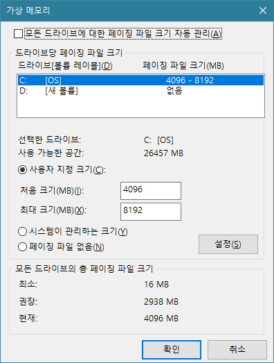
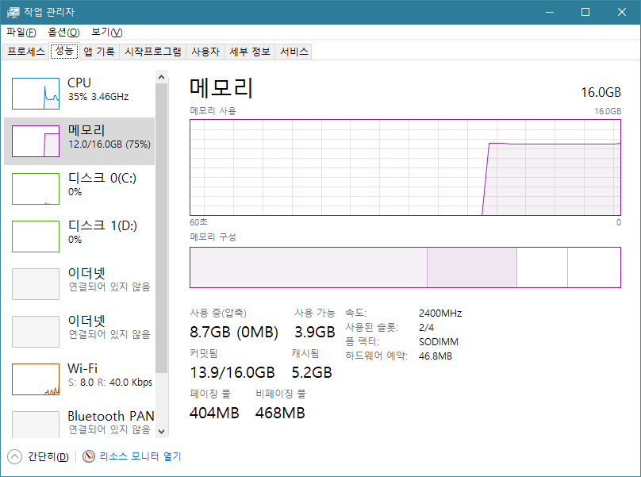
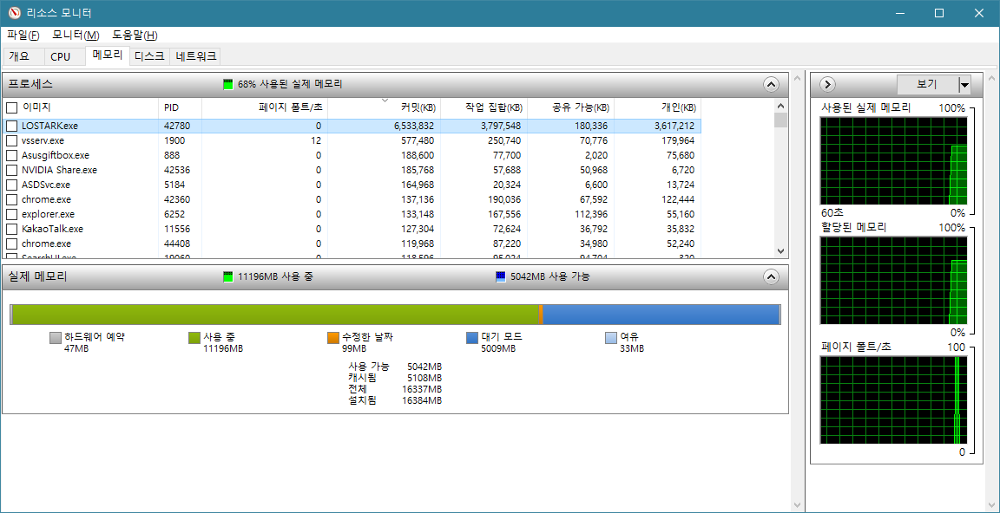
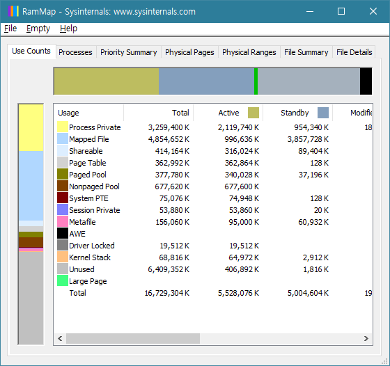
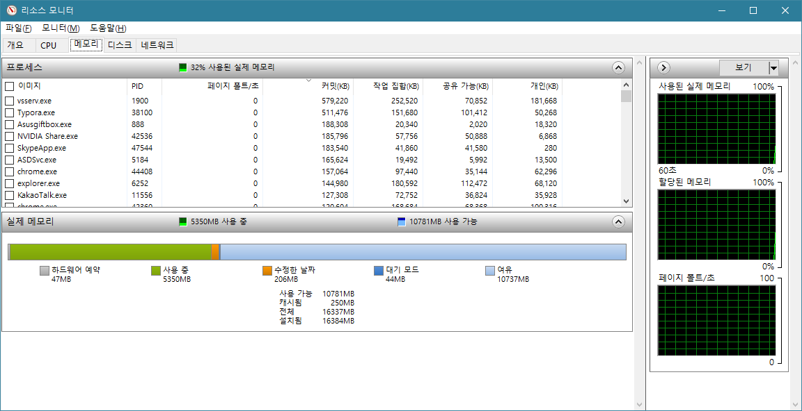
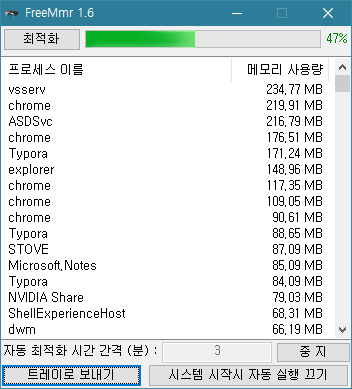

# 메모리 부족 문제 해결

## 문제 상황

- ASUS 게이밍 노트북을 사용한 지 어느덧 1년이 다 되어 간다. 당시 제법 좋은 스펙으로 사둔 녀석이라 와우부터 시작해서 여러 고사양 스팀 게임, 최근의 로스트아크까지 문제 없이 잘 돌아가던 녀석인데, 문제는 자꾸만 메모리 부족이 뜨면서 게임이 중간에 꺼져버리는 상황이 발생한다는 것이었다. 기본 8GB 램으로는 역시 부족하다고 생각해서 똑같은 8GB램으로 증축한지도 몇 달이 지났다. 그런데 이놈의 메모리 부족은 해결될 기미가 보이지 않는다!

## 1차 해결 방안

> 
>
> 나는 분명히 16GB 램을 가지고 있는데, 왜 10GB밖에 사용할 수 없을까?

- 상황을 재현하기 위해 원래의 설정으로 되돌렸더니 커밋된 용량이 정상적으로 표시되지 않고 있다. 그 점은 무시하더라도 가지고 있는 램의 70%도 사용하지 못하고 있는 상황이 아이러니했다.
- 단순히 램을 갈아끼우면 그만이라고 생각했는데, 컴퓨터는 여전히 초기의 램 사용 설정량을 따르고 있었던 것이다.
- 결국 간단한 검색을 통해서 해결 방법을 찾아냈다.
- 내 PC > 속성 > 고급 시스템 설정 > 고급 > 가상 메모리 탭으로 가보자.

> 
>
> 실종된 램의 정체!

- 자세한 매커니즘은 모르겠으나, 컴퓨터는 자신이 수행할 수 있는 메모리 이상의 요청을 받았을 때 과부하되는 것을 방지하기 위해서 위처럼 가상 메모리 영역을 설정하는 듯했다.
- 그로 인해 저 페이징 파일의 크기만큼의 영역은 상시 비워둬야 했던 것!

> 
>
> 최대 크기가 초기의 8GB 버전으로 설정되어있는 모습

- 컴퓨터가 나도 모르게 여유 공간을 챙기고 있었다니, 기특하기도 하면서 한편으로는 괘씸했다. 어쨌거나 나는 문제를 해결하는 게 우선이기 때문에 저 문제의 페이징 파일이라는 녀석을 아예 없애버렸다.

> 
>
> 이제 정상적으로 16GB가 인식되는 것을 볼 수 있었다.

## 2차 해결 방안

- 자, 이제 램도 최대로 설정했으니 메모리를 귀신 같이 잡아먹는 크롬을 켜고도 문제 없이 게임을 즐길 수 있겠지? 라고 생각하기 무섭게, 런타임 에러는 또다시 등장해 나를 괴롭혔다.

- 계속해서 작업 관리자 설정 탭을 기웃거리던 나는 흥미로운 화면을 발견했다.

> 
>
> 로스트 아크가 잡아먹는 메모리의 양은 어마어마하다!

- 바로 성능 탭 아래 위치한 '리소스 모니터 열기' 버튼이었다!
- 리소스 모니터를 통해서 현재 사용되는 프로그램들이 메모리를 얼마나 사용하고 있는지 알 수 있었다.
- 그런데 의아한 부분이 하나 있다. 사용 중인 영역도 이해가 가고, 여유 공간도 납득할 수 있는데, 저 대기 모드란 뭐란 말인가?

> 대기 모드 메모리(standby memory)는 일종의 캐시 저장소로, 언제든지 다시 불러올 수 있도록 파일을 임시로 저장하는 공간을 말한다.

- 대기 모드란 말 그대로 필요한 상황에 꺼내쓸 수 있는 엑스트라들을 모아둔 곳인데, 무려 5GB나 되는 몸집으로 여유 공간을 짓누르고 있다니 얼마나 아이러니한 상황인가?
- 검색을 계속하던 와중에 'RAMMap'이라는 프로그램을 발견했다.

> 
>
> RAMMap은 램 메모리를 관리해주는 프로그램이다.

- 프로그램 상단의 Empty 탭을 누르면 Empty Standby List라는 기능이 보이는데, 이를 실행했더니 놀라운 일이 벌어졌다.

> 
>
> 이렇게나 손쉽게 메모리 공간을 확보할 수 있다니!

- 이로서 게임을 방해하는 메모리 문제는 해결된 것으로 보인다. 그러나

## 총평

- RAMMap을 통한 메모리 관리는 아주 효과적이었다. 그러나 어느덧 C 드라이브를 잠식해 꽉 채워버리는 카카오톡 사진들, Chrome의 캐시파일들처럼 저 대기 모드 메모리 역시 시간이 지나면 스멀스멀 다시 올라와 여유 공간을 잡아먹기 시작한다.
- 인터넷을 뒤지다 보니 RAMMap의 Empty Standby List 기능만을 프로그램으로 만들어놓은 녀석을 발견했다. 관리자 모드로 실행하도록 설정을 변경하고 작업 표시줄에 고정시켜두니 생각날 때마다 메모리를 비워줄 수 있어서 편리했다.
- 아는 게 병이라고, 오히려 주기적으로 청소해줘야 한다는 압박감이 생겨나긴 했지만, 영문도 모르고 당하고 있던 와중에 스스로 문제의 답을 찾아낸 것 같아서 뿌듯하다. 

# FreeMmr

## 새로운 프로그램

- FreeMmr이라는 memory 매니징 프로그램을 발견했다.

> 

- 조작법은 아주 간단하다.
- 프로그램을 실행시키면 현재 실행중인 프로세스들을 메모리 사용량 순서로 나열해준다.
- 게이지의 퍼센티지를 통해 현재 메모리 사용량을 확인할 수 있다.
- 최적화 버튼을 누르면 메모리를 정리해주고 몇 %가 확보되었는지 팝업으로 알려준다.
- 이 프로그램이 마음에 드는 이유는 자동 최적화 기능 때문이다.
- 자동 최적화 시간을 설정하고 시작버튼을 누르면(위 사진은 이미 적용된 상태) 설정한 시간 간격마다 메모리를 자동으로 정리해준다.
- 알트탭을 하고 대기 모드 메모리를 지워줄 필요가 없이 간단하게 메모리 사용량을 관리할 수 있게 되었다.
- 또한 메모리 사용량을 보다 직관적으로 알 수 있다.

